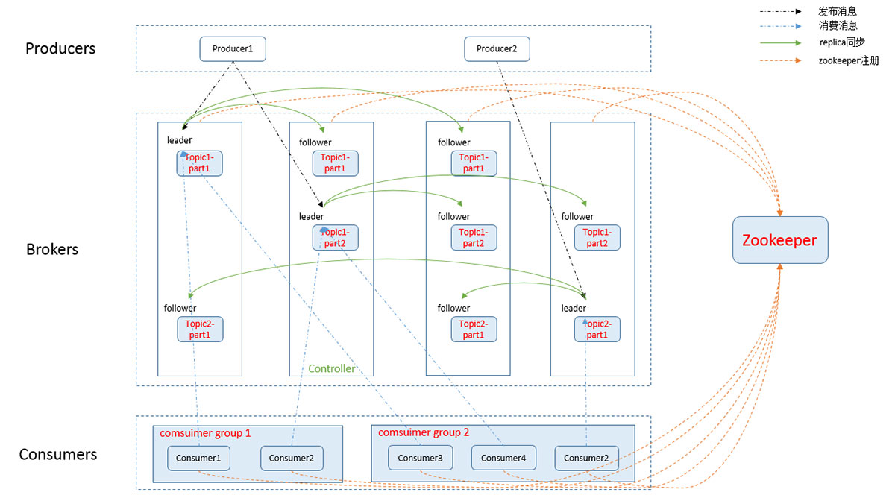

# kafka
- <a href="#introduction">簡介</a>
- <a href="#concept">核心概念</a>
    - <a href="#topic">Topic</a>
    - <a href="#message">Message</a>
    - <a href="#producer">Producer</a>
    - <a href="#broker">Broker</a>
    - <a href="#consumer">Consumer</a>
    - <a href="#consumerGroup">Consumer Group</a>
    - <a href="#partition">Partition</a>

  
-------------

## 
簡介

- 分佈式消息流平臺(Stream processing)，它同時也是一款開源的基於發佈訂閱模式的消息引擎系統(Message broker)。
- 採用分散式架構，方便水平擴張，提供高吞吐量、高可靠性、可用性與擴展性，且將資料存放於硬碟空間，可以長時間保存資料。

-------

## 
核心概念

- ##### 
Topic

    - 對於消息的定義及分類 (類似於DB table)
    
- ##### 
Message

    - 每個 message 都屬於一個 topic，該 message 會列入所屬 topic 的列隊
    
- ##### 
Producer

    - 消息發送者，push 消息至 broker
    
- ##### 
Broker

    - Broker 儲存消息的 server，多個 Broker 即是 kafka cluster
    - kafka cluster 負責 topic 的 partition , replica 
    
- ##### 
Consumer

    - 消息消費者，從 Kafka 集群的 broker 中 pull message
    
- ##### 
Consumer Group

    - 消息消費者，從 Kafka 集群的 broker 中 pull message
    

-------

- reference: 

-------

