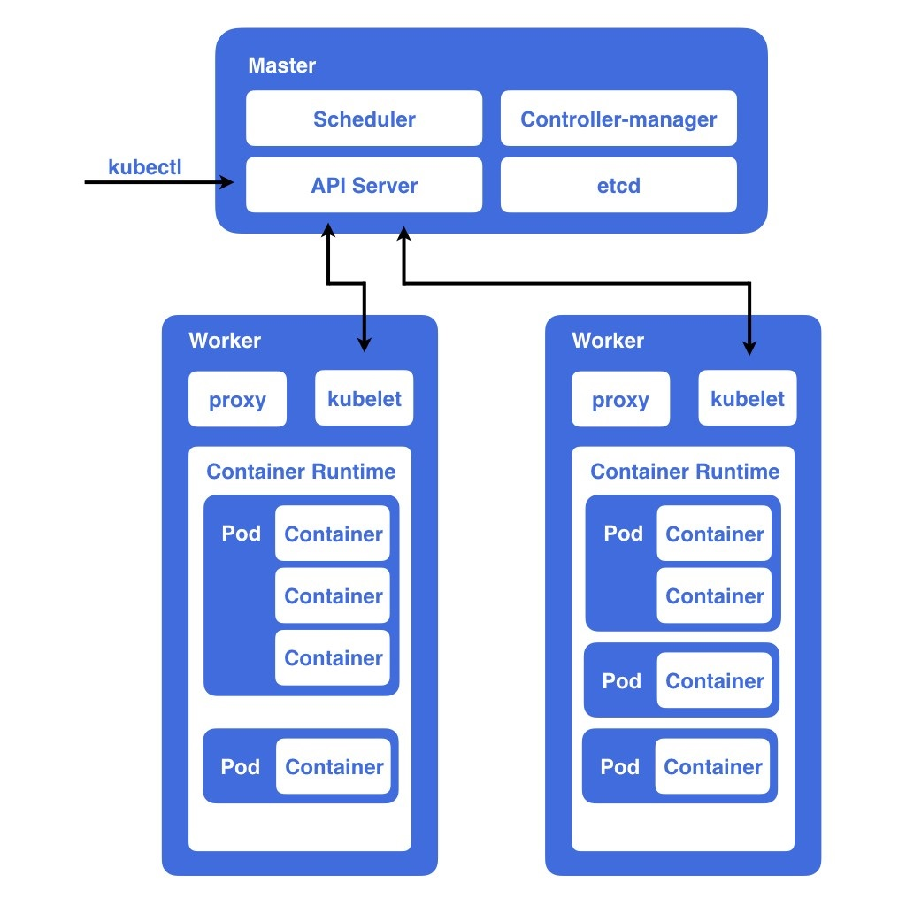
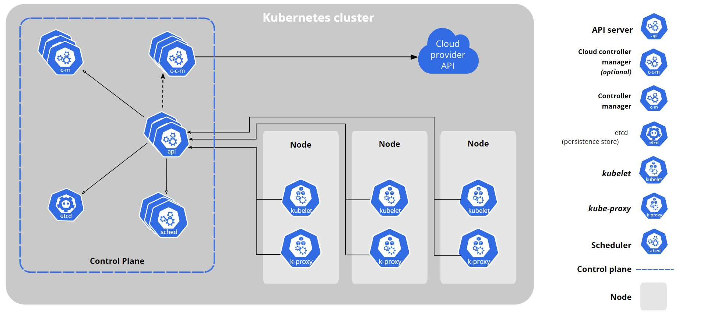

# kubernetes basic concept
- <a href="#introduction">介紹</a>
- <a href="#components">Components</a>
  - <a href="#control-plane-components">Control Plane Components</a>
    - <a href="#kube-apiserver">kube-apiserver</a>
    - <a href="#etcd">etcd</a>
    - <a href="#kube-scheduler">kube-scheduler</a>
    - <a href="#kube-controller-manager">kube-controller-manager</a>
  - <a href="#node-components">Node Components</a> 
    - <a href="#kubelet">kubelet</a>
    - <a href="#kube-proxy">kube-proxy</a>
- <a href="#components">Workloads</a>
  - <a href="#pods">Pods</a>
  - <a href="#workload-resources">Workload Resources</a>
  
-------------

### 
介紹

- Kubernetes, also known as K8s, is an open-source system for automating deployment, scaling, and management of containerized applications.
    - 同時部署多個容器到多台機器上（Deployment）
    - 服務的乘載量有變化時，可以對容器做自動擴展（Scaling）
    - 管理多個容器的狀態，自動偵測並重啟故障的容器（Management）

-------

### 
Components

#### 
1. Control Plane Components

> Control Plane Components 負責對cluster做出全局決策（例如: 調度），以及偵測和回應cluster事件。

- 
<a htrf="https://kubernetes.io/docs/reference/command-line-tools-reference/kube-apiserver/">kube-apiserver</a>

    > The API server is a component of the Kubernetes control plane that exposes the Kubernetes API. The API server is the front end for the Kubernetes control plane. kube-apiserver is designed to scale horizontally—that is, it scales by deploying more instances. You can run several instances of kube-apiserver and balance traffic between those instances.
  - 管理整個 Kubernetes 所需 API 的接口，例如從 Command Line 下 kubectl 指令就會把指令送到這裏
  - 負責 Node 之間的溝通橋樑，每個 Node 彼此不能直接溝通，必須要透過 apiserver 轉介
  - 負責 Kubernetes 中的請求的身份認證與授權

- 
etcd

    > Consistent and highly-available key value store used as Kubernetes' backing store for all cluster data.
  - 用來存放 Kubernetes Cluster 的資料作為備份，當某些原因而故障時，可以透過 etcd 還原 Kubernetes 的狀態

- 
<a href="https://kubernetes.io/docs/reference/command-line-tools-reference/kube-scheduler/">kube-scheduler</a>

    > Control plane component that watches for newly created Pods with no assigned node, and selects a node for them to run on.
  - Kubernetes 的 Pods 調度員，scheduler 會監視新建立但還沒有被指定要跑在哪個 Node 上的 Pod，並根據每個 Node 上面資源規定、硬體限制等條件去協調出一個最適合放置的 Node 讓該 Pod 啟動
  

- 
<a href="https://kubernetes.io/docs/reference/command-line-tools-reference/kube-controller-manager/">kube-controller-manager</a>

  > The Kubernetes controller manager is a daemon that embeds the core control loops shipped with Kubernetes. In applications of robotics and automation, a control loop is a non-terminating loop that regulates the state of the system. In Kubernetes, a controller is a control loop that watches the shared state of the cluster through the apiserver and makes changes attempting to move the current state towards the desired state. Examples of controllers that ship with Kubernetes today are the replication controller, endpoints controller, namespace controller, and serviceaccounts controller.

  > Kubernetes controller manager 是由多個 controller 集合而成，不中斷的透過 kube-apiserver 監控cluster的各個狀態，自動化的達到理想的狀態。

  - <a href="https://kubernetes.io/docs/concepts/architecture/nodes/#node-controller"> Node controller: Responsible for noticing and responding when nodes go down. </a>
  - Job controller: Watches for Job objects that represent one-off tasks, then creates Pods to run those tasks to completion.
  - Endpoints controller: Populates the Endpoints object (that is, joins Services & Pods).
  - Service Account & Token controllers: Create default accounts and API access tokens for new namespaces.

-------

-------

- lab: https://www.katacoda.com/courses/kubernetes
- reference: 
    - https://cwhu.medium.com/kubernetes-basic-concept-tutorial-e033e3504ec0
    - https://kubernetes.io/docs/concepts/overview/components/

-------

