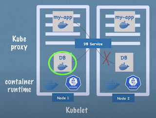

# What is Kubernetes?
- Open source container orchestration tool
- Develop by Google
- Helps you manage containerized applications in different development environments
 
# What problems does Kubernetes solve?
> Microservices cost increased usage of container technologies because containers offer the perfect host for small 
> independent applications, and the rise of containers resulted in applications are comprised of hundreds or even thousands of containers,
> managing those containers across multiple environments using script and self-made tools can be really complex and even impossible.

# What features do orchestration tools offer?
- HA(high availability) or No Downtime， 高可用性
- Scalability or high performance，可擴充性
- disaster recovery - backup and restore
# Kubernetes Components
- Pod
    - Smallest unit of k8s
    - Abstraction of container
        - k8s將container抽象為pod,解耦如docker的容器服務
        - 抽象container後不需操作容器，只需要操作k8s layer
    - Pod 一般只有一個container(可run多個)
    - Pod有虛擬IP(非container)，當pod重啟會賦予新的IP
- Service
    - Entry point of Pods.
    - Permanent IP. 
    - Lifecycle of Pods and Service are Not connected.

- Ingress
    - Route traffic into k8s cluster 
    - Service entry point.
    
- ConfigMap
    - Used to store data
    - 如果有多個container 都有使用到的參數可以共同定義
    - 方便解耦設定 

- Secret
    - 特性與ConfigMap相似，差別只在於存取的為敏感性資料
    - Used to store secret data
    - Base 64 encoded

- Volumes
    - Saves data that we want to out of k8s cluster lifecycle
    - Attaches a physical storage on a hard drive to your pod
    - A local machine (same server node where the pod is running )
    - A remote storage (cloud or physical machine)
    
- Deployment
    - Abstraction of pods
    - Define blueprints for pods

- Stateful
    - Abstraction of pods
    - Define blueprints for pods that have its status. e.g. Kafka MongoDb MySql e.t.c
    - Avoid data inconsistencies are offered
  

  
# Kubernetes Architecture
- work node
  - kubelet
    - interact with containers and node
    - assign resources to container in the node
    - start pods inside node 
  - kube proxy
    - forward the requests
    - make sure that the communication works in a performant way with low overhead  
  - container runtime
    

- master node
  - Api Server
    - cluster gateway, we use UI(kubernetes dashboard), Command tool(kubectl) interact k8s cluster through Api Server
    - cluster gatekeeper for authentication to make sure only authenticated and authorized requests get through to the cluster
  - Scheduler
    - schedule pod or component to a available node 
  - Controller Manager
    - detect cluster state change
  - etcd
    - etcd is a cluster brain
    - cluster changes get stored in the key value store 
    - e.g.
      - How Scheduler knows what resource of nodes are available ?
      - How Controller knows cluster state change ?
  

- Ref
  - https://www.youtube.com/watch?v=X48VuDVv0do&t=7999s
  - https://kubernetes.io/docs/reference/generated/kubernetes-api/v1.19/#-strong-api-overview-strong-
     