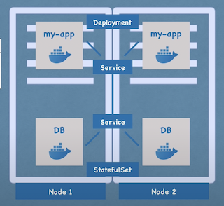

# What is Kubernetes?
> 由google開源的容器編排工具，可以管理不同環境容器化的應用，像是實體機、虛擬機、雲等主機
# What problems does Kubernetes solve?
> 在日益增長容器化的服務，管理可能是上百或上千跨環境的容器，僅僅使用腳本或客製化的處理方式，並不切實際。
> k8s container orchestration technologies 之所以誕生。
# What features do orchestration tools offer?
- HA(high availability) or No Downtime， 高可用性
- Scalability or high performance，可擴充性
- disaster recovery - backup and restore
# Kubernetes Components
- Pod
    - Smallest unit of k8s
    - Abstraction of container
        - k8s將container抽象為pod,解耦如docker的容器服務
        - 抽象container後不需操作容器，只需要操作k8s layer
    - Pod 一般只有一個container(可run多個)
    - Pod有虛擬IP(非container)，當pod重啟會賦予新的IP
- Service
    - Entry point of Pods.
    - Permanent IP. 
    - Lifecycle of Pods and Service are Not connected.

- Ingress
    - Route traffic into k8s cluster
    - Service entry point.
    
- ConfigMap
    - Used to store data
    - 如果有多個container 都有使用到的參數可以共同定義
    - 方便解耦設定 

- Secret
    - 特性與ConfigMap相似，差別只在於存取的為敏感性資料
    - Used to store secret data
    - Base 64 encoded

- Volumes
    - Saves data that we want to out of k8s cluster lifecycle
    - Attaches a physical storage on a hard drive to your pod
    - A local machine (same server node where the pod is running )
    - A remote storage (cloud or physical machine)
    
- Deployment
    - Abstraction of pods
    - Define blueprints for pods

- Stateful
    - Abstraction of pods
    - Define blueprints for pods that have its status. e.g. Kafka MongoDb MySql e.t.c
    - Avoid data inconsistencies are offered

  
# Kubernetes Architecture 
    
     